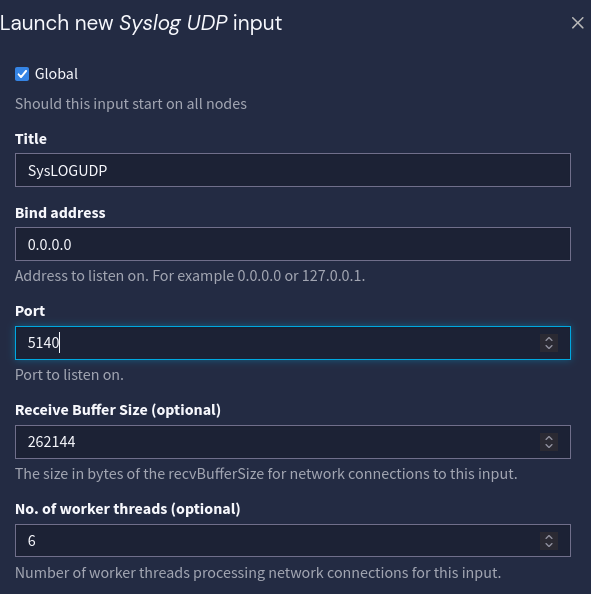
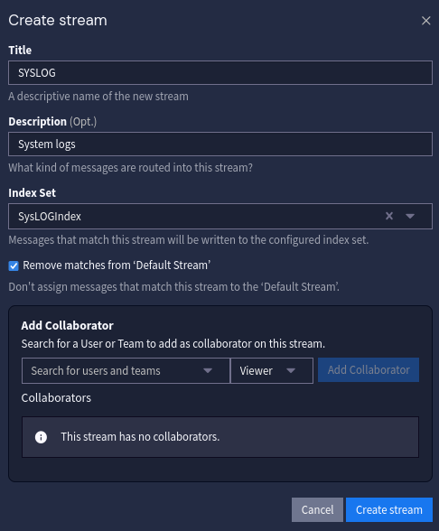
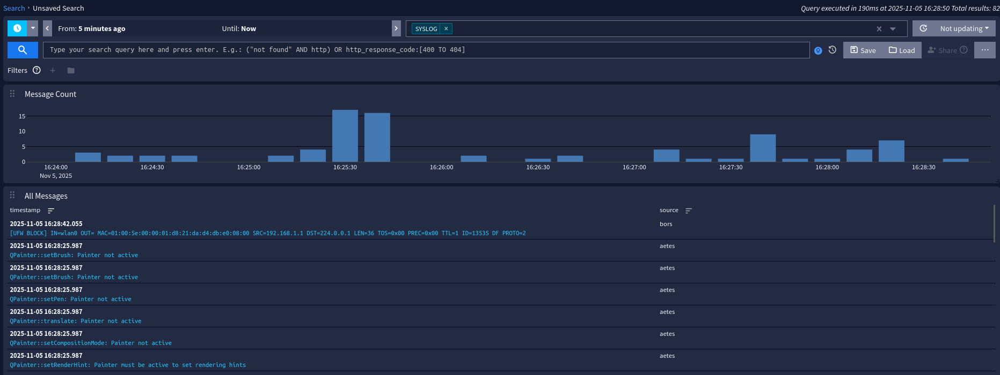
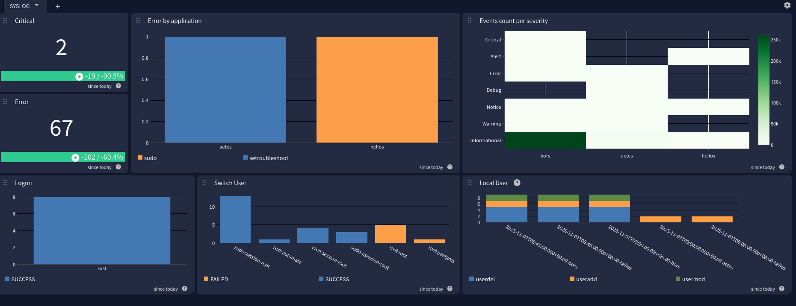

# Install

Completed in containers on RaspberryPie, web service behind nginx.

## Customize docker-compose

Create a .env file and replace the values per instruction.

[env file](https://github.com/Graylog2/docker-compose/blob/main/open-core/.env.example)


## Issue with MongoDB

MongoDB 5.0+ doesn't work on RaspberryPie MongoDB requires ARMv8.2-A or higher
Followed & used custom build from:  https://github.com/themattman/mongodb-raspberrypi-docker
```bash
wget https://github.com/themattman/mongodb-raspberrypi-docker/releases/download/r7.0.4-mongodb-raspberrypi-docker-unofficial/mongodb.ce.pi4.r7.0.4-mongodb-raspberrypi-docker-unofficial.tar.gz

docker load --input mongodb.ce.pi4.r7.0.4-mongodb-raspberrypi-docker-unofficial.tar.gz
```

Simply replace the service image to mongodb-raspberrypi4-unofficial-r7.0.4:latest


## Graylog start

Once Graylog starts the first time it will provide you with credentials to create and dispatch a certificate.
Folllow the steps and restart Graylog, you can now use the password saved in your env file.


# Centralize log from Linux system to Graylog

## Graylog configuration

Input: SysLOGUDP



Indice: SysLOGIndex


Stream: SYSLOG



Start your input.

Check your stream:




## Setup the hosts

On hosts add syslog redirection to graylog in /etc/rsyslog.d/60-graylog.conf

```bash
*.*@192.168.1.207:5140;RSYSLOG_SyslogProtocol23Format
```

Allow Selinux to use port 5140
```bash

semanage port -a -t syslogd_port_t -p tcp 5140:
```

Check traffic:

```bash
tcpdump -i any -v "port 5140"
```

## SYSLOG Dashboard




### Events to catch

- Account Create / Delete
```bash
new user: name=plop, UID=1003, GID=1003, home=/home/plop, shell=/bin/sh, from=/dev/pts/1
new group: name=plop, GID=1003

delete user 'plop'
removed group 'plop' owned by 'plop'


add 'plop' to group 'docker'
```
- Session Open / Failed / Timeout / Close

facility: security/authorization
facility_num:10

```bash
session opened for user rust(uid=1000) by rust(uid=0)
pam_unix(sshd:session): session opened for user rust(uid=1000) by rust(uid=0)
Accepted publickey for rust from 192.168.1.111 port 55866 ssh2: RSA SHA256:K/bEBOlje8CAOacxUamu4q7qPjL9GS99a8PUyIidRQM
pam_unix(sudo-i:session): session opened for user root(uid=0) by rust(uid=1001)

# USER run command via sudo
rust : TTY=pts/0 ; PWD=/home/rust ; USER=root ; COMMAND=/bin/grep rust /var/log/secure

# USER logged out
Disconnected from user rust 192.168.1.111 port 58136


# FAIL Try to ssh with non existen user
Invalid user plop from 192.168.1.111 port 54844
password check failed for user (rust)

# FAIL Try to sudo wrong password
pam_unix(sudo-i:auth): authentication failure; logname=rust uid=1001 euid=0 tty=/dev/pts/1 ruser=rust rhost=  user=rust
rust : 1 incorrect password attempt ; TTY=pts/1 ; PWD=/root ; USER=root ; COMMAND=/bin/bash


```
- Package Install / Update / Remove

- Containers Events


# Business application

See to push GELF logs from any / either app

# TODO

- [ ] Remaining exceptions
- [x] Configuration streams & Inputs
- [x] Create Dashboard ~ Pipeline ?

Reference:
- [:books: Graylog doc](https://go2docs.graylog.org/current/home.htm)
- [:octocat: Graylog repository](https://github.com/Graylog2)
- [:octocat: Graylog docker-compose repo](https://github.com/Graylog2/docker-compose)

Custom MongoDB:
- [:octocat: MongoDB themattman](https://github.com/themattman/mongodb-raspberrypi-docker)
